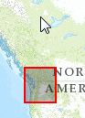

Sample: Issue with ArcGIS JavaScript API Map and Ajax Control Toolkit
=====================================================================

## Problem ##

When placing an [ArcGIS API for JavaScript] map inside of an [AJAX Control Toolkit] TabPanel, graphics drawn on the map are offset from where they should be.



## Workarounds ##
Although the best solution to this issue would be to rewrite the UI portion so that it no longer uses the [AJAX Control Toolkit], if that is not an option you can avoid these issues by placing the map into an `iframe` element.

## How to use *extentSelector* widget in an `iframe` ##

1. Copy these files from this project into your own project:
	* `Scripts/wsdot/extentSelector.js`
	* `extentSelector.html`
2. In the TabPanel that will contain the extent selector map, add an event handler in the TabPanel's `OnClientClick` attribute. This is demonstrated in the file `Default.aspx`.
	```xml
<ajaxToolkit:TabPanel ID="ExtentSelectorTabPanel" HeaderText="ExtentSelector" runat="server" OnClientClick="mapStuff.onExtentSelectorTabClick">
	<ContentTemplate>

	</ContentTemplate>
</ajaxToolkit:TabPanel>
	```
3. Add the function specified in the previous step.  A sample of this can be found in `Scripts\Default.js`.  This function needs to create an `iframe` element with the `src` attribute set to `extentSelector.html`.
	```javascript

	/** Creates the map iframe if it does not already exist.
	@param {Sys.Extended.UI.TabPanel} tabPanel The tab panel that was just activated.
	@param {HTMLDivElement} tabPanel._element This is the div element of the tab panel.
	@param {EventArgs} e
	*/
	function onExtentSelectorTabClick(tabPanel, e) {
		var handleExtentChange;
		if (!extentSelectorFrame) {
			extentSelectorFrame = document.createElement("iframe");
			extentSelectorFrame.src = "extentSelector.html";
			extentSelectorFrame.name = "extentSelector";
			tabPanel._element.appendChild(extentSelectorFrame);

			// Setup the event handler for the extent change.
			handleExtentChange = function (event) {
				var geom;
				// Get the state plane geometry.
				if (event && event.data !== undefined) {
					if (event.data !== null) {
						geom = event.data.stateGeometry;
					}
				}

				// TODO: Do something with the geometry.
			};

			// Setup event listeners for messages from child iframe window.
			// Modern browsers use addEventListener, but not all browsers do.
			if (window.addEventListener) {
				window.addEventListener("message", handleExtentChange, false);
			} else if (window.attachEvent) {
				window.attachEvent("onmessage", handleExtentChange);
			} else if (window.onmessage) {
				window.onmessage = handleExtentChange;
			}
		}
	}
	```
4. Add a CSS rule for the iframe to specify its size.
	```css

	/* Specify the size of the iframe here */
	iframe[src='extentSelector.html'] {
		width: 100%;
		height: 600px; /* Height must be an explicit value. */
	}
	```

## Remaining Issues ##

See the [issues list on GitHub].

## Notes ##

* The map `iframe`'s size will be 400 px x 400 px if certain conditions are not met.
	* The `iframe` cannot be given an `id` attribute.
	* The `iframe` must be created after the containing tab panel has been activated (i.e., in the tab panel's `OnClientClick` event handler). 

* The best way to handle events from the `iframe` window in the parent window is to use [window.postMessage]. This seems to be the *only* way that will work with Internet Explorer 8.


[ArcGIS API for JavaScript]:http://help.arcgis.com/en/webapi/javascript/arcgis/
[AJAX Control Toolkit]:http://www.ajaxcontroltoolkit.com/
[issues list on GitHub]:https://github.com/WSDOT-GIS/ArcGIS-JS-with-AJAX-Control-Toolkit/issues
[Map]:http://help.arcgis.com/en/webapi/javascript/arcgis/jsapi/map.html
[window.postMessage]:https://developer.mozilla.org/en-US/docs/Web/API/window.postMessage
